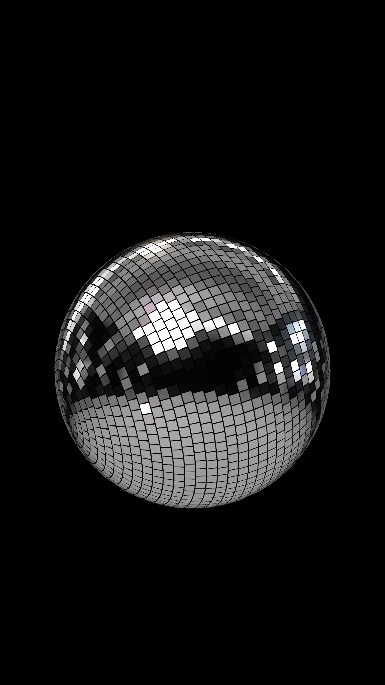
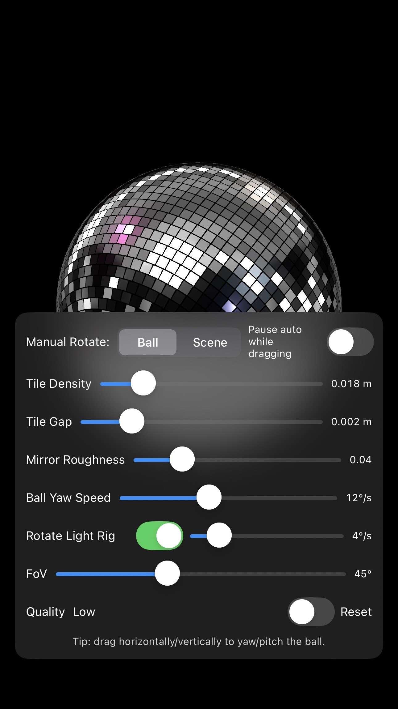
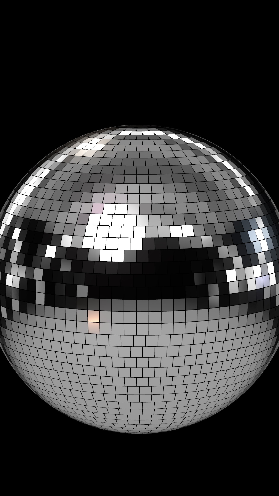

# 🪩 DiscoBall

A shiny, interactive disco ball built with SwiftUI and RealityKit. Spin it, tweak it, and watch the sparkles dance!

  
  
  

## ✨ Features

- **Realistic disco ball** with procedurally generated mirror tiles
- **Interactive controls** - drag to rotate, tap to toggle settings
- **Dynamic lighting** with professional 3-point lighting setup
- **Customizable parameters**:
  - Tile density and gap size
  - Mirror roughness
  - Rotation speeds
  - Camera field of view
- **Performance modes** - toggle between high and low quality
- **Smooth animations** with subtle wobble effects

## 🎮 Controls

- **Drag horizontally/vertically** to manually rotate the ball or light rig
- **Tap anywhere** to show/hide the control panel
- **Toggle "Pause auto while dragging"** to control manual vs automatic rotation
- **Use sliders** to adjust all the disco ball properties in real-time

## 🛠️ Technical Details

Built with:
- **SwiftUI** for the UI
- **RealityKit** for 3D rendering
- **Procedural geometry generation** for the mirror tiles
- **Spherical coordinate mathematics** for tile placement
- **PBR materials** for realistic reflections

## 🚀 Getting Started

1. Open `DiscoBall.xcodeproj` in Xcode
2. Build and run on iOS 17+ or macOS 14+
3. Start spinning and enjoy the sparkles! ✨

## 🎨 Customization

The app includes a comprehensive control panel where you can adjust:
- **Geometry**: Ball radius, tile size, gaps, jitter
- **Materials**: Mirror roughness and reflectivity
- **Animation**: Rotation speeds for ball and lights
- **Camera**: Field of view and distance
- **Performance**: Quality settings for different devices

Perfect for experimenting with 3D graphics, materials, and lighting in RealityKit!

---

*Made with ✨ and a lot of AI*
